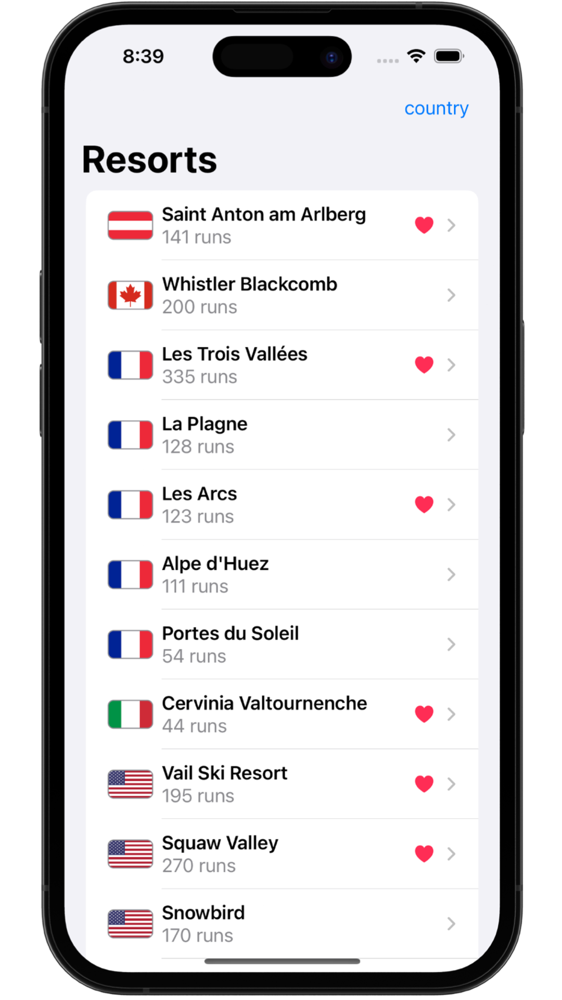
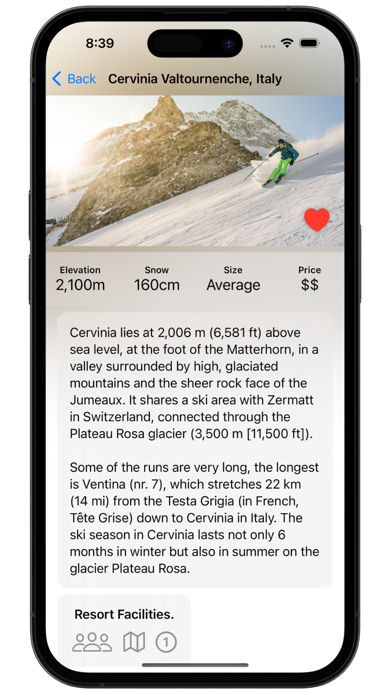
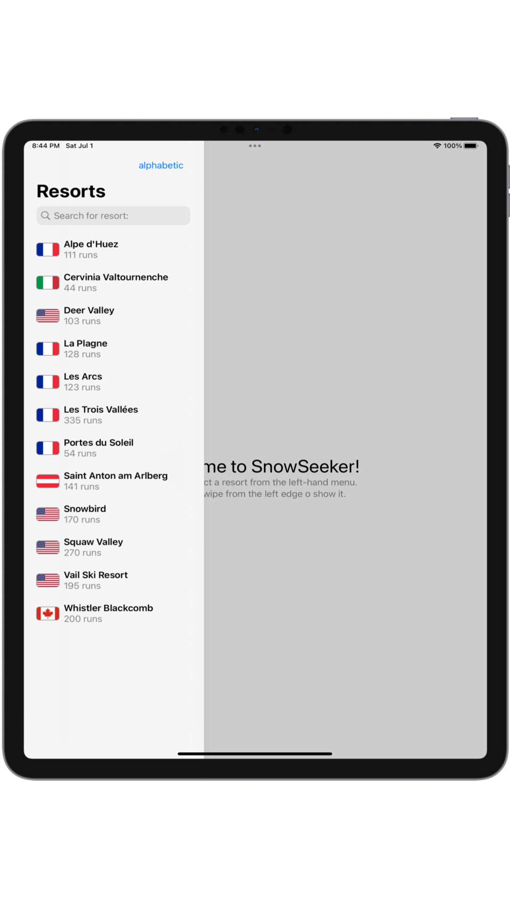

# &nbsp; 🗻 Snow Seeker 

### Project 19
##### Author: *[MatviiArtemenko](https://github.com/100DaysOfSwiftUI-MatviiArtemenko)*

##### 100DaysOfSwiftUI form *[@twostraws](https://twitter.com/twostraws "twostraws twitter page")*

##### Follow along: *[100DaysOfSwiftUI](https://www.hackingwithswift.com/100/swiftui "Hacking with Swift")*

---

> *This wasn’t a particularly complicated project, but it still taught new skills such as split view layouts, optional alerts, layout with transparent groups, and even an improved way of formatting lists in text. It also gave you the chance to practice lots of core skills, such as handling `Codable`, creating scrolling lists, and more. This kind of app is really good as a template, because it’s the kind of thing you can use again and again in the future just by varying the kind of content you feed into it. Template apps – as well as the techniques underlying them – are the “bread and butter” of iOS apps: the kind of thing that is never going to set the world on fire, but also so fundamentally useful and common that you can’t do without them.*

---

## &nbsp; 📚 Covered topics

Codable, Color()

---
## &nbsp; 🎖 Challenge
* [x] Add a photo credit over the `ResortView` image. The data is already loaded from the JSON for this purpose, so you just need to make it look good in the UI.

* [x] Fill in the loading and saving methods for `Favorites`.

* [x] For a real challenge, let the user sort the resorts in `ContentView` either using the default order, alphabetical order, or country order.
 

---
## &nbsp; 📲 Screenshoot

  
  
  

---
##  &nbsp; 🔍 &nbsp; Resources 

* [Apple documentation - Geometry Reader](https://developer.apple.com/documentation/swiftui/geometryreader/)

